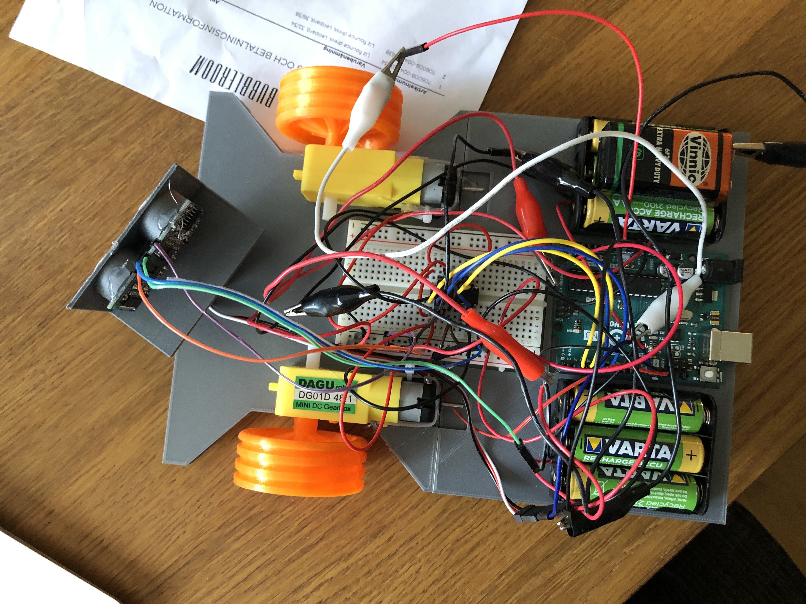

# self_driving_car
# Arduino self driving car using HC-SR05 Ultrasonic Distance Sensor Module

## This project uses the arduino servo library (Servo.h) to control the servo and the newping library (NewPing.h) to control and improve the accuracy of the distance sensor measurments. ***Note that the NewPing library has to be installed by the user, it is not a standard arduino library.***

##    For this project you will need an arduino uno, an L293D motor driver, an HC-SR05 Ultrasonic Distance Sensor Module, a 5g small servo, two DAGU DG01D 48:1 dc geared motors, two battery holders for 3 batteries each, 6 1.2V rechargeable batteries totalling 7.2V for the motors and one 9V E battery to power the arduino as well as wires for the connections. The project also uses 3D-printed parts both for the base mounting plate for the parts and for the wheels and servo mount. These parts are available via the links below:
 

* [Base plate and castor wheel](https://www.thingiverse.com/thing:4674544) made by me for use only under [Creative Commons Non-Commercial license](https://creativecommons.org/licenses/by-nc/4.0/)
* [HC-SR05 sensor servo mount](https://www.thingiverse.com/thing:4674535) made by me for use only under [Creative Commons Non-Commercial license](https://creativecommons.org/licenses/by-nc/4.0/)
* [Front motorized wheels](https://www.thingiverse.com/thing:3188355) wheels from this design, credit to creator Kaya3D for use only under [Creative Commons Non-Commercial license](https://creativecommons.org/licenses/by-nc/4.0/)

 
Finished car with all parts mounted
 

  The car works by using the ultrasonic distance sensor to track the distance to the nearest object directly in front of the car. If the distance to the nearest object is over 200cm it will register as exactly 200cm, it will not track higher distances. Once the distance drops below the number defined in the code by the "stop_distance" value the car will stop.

It will then turn the servo to record the distance to the nearest object on it's right and left side. It will save these distances as distanceRight and distanceLeft and will then choose to turn in the direction that is the furthest away from any obstacles. It turns by first driving backwards to clear any wall or obstacle and then spinning the wheels in opposite directions. Once it has turned it will continue driving forward until it encounters an obstacle. 

 
Wiring example for this design:
 

 
 Wiring schematic for this design:
 

 The wiring schematic and example are rather hard to read, this is due to the fact that I could not find a good program to make wiring diagrams for more complex designs, and I apologize for this inconvenience. Note that as of now the 9V battery drains very fast and will after some time not always output a steady enough current, and the car will then seize to work and will need to be restarted. At this point you need to change the battery, even if it is not completely empty. The sensor will also sometimes not be able to detect small or thin objects such as chair legs. 

